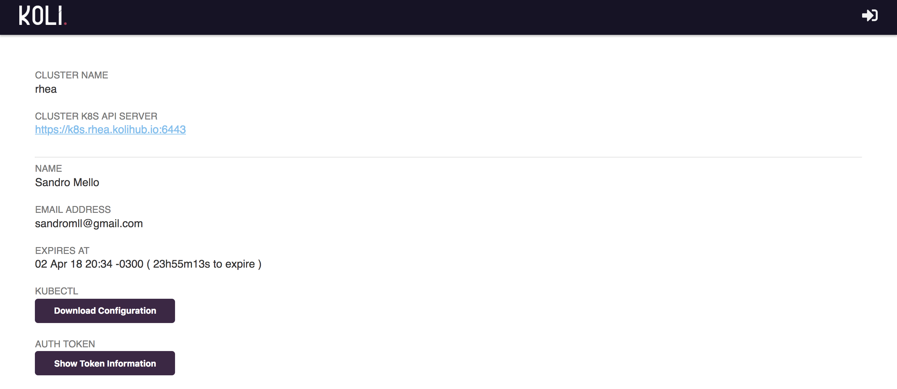
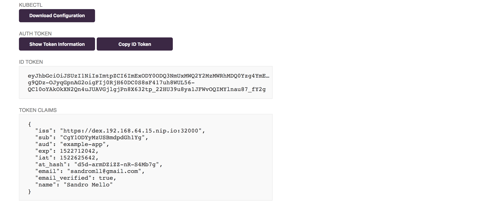

# Kube Dex

A helper web-app which talks to one or more [Dex Identity services](https://github.com/coreos/dex) to generate a kubeconfig file for download.

- Generate tokens for a specific cluster
- SSL Support
- Customizable themes

# Screenshots

---

# Getting Started

TODO
